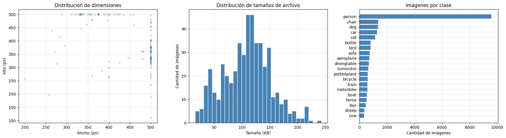
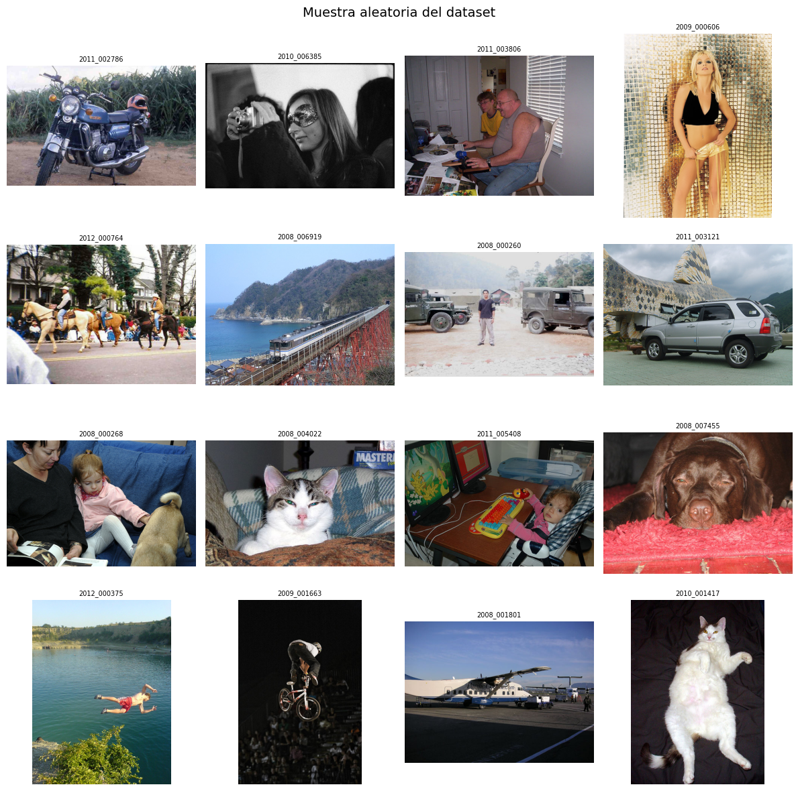
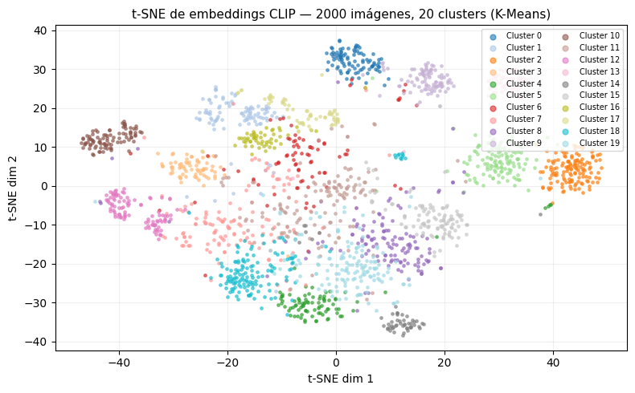
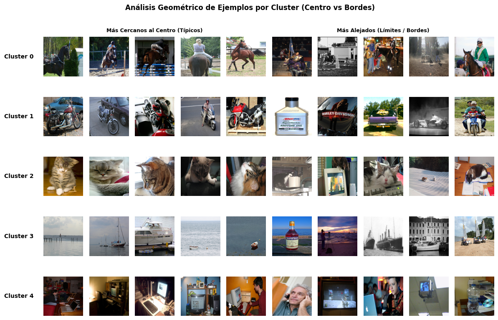
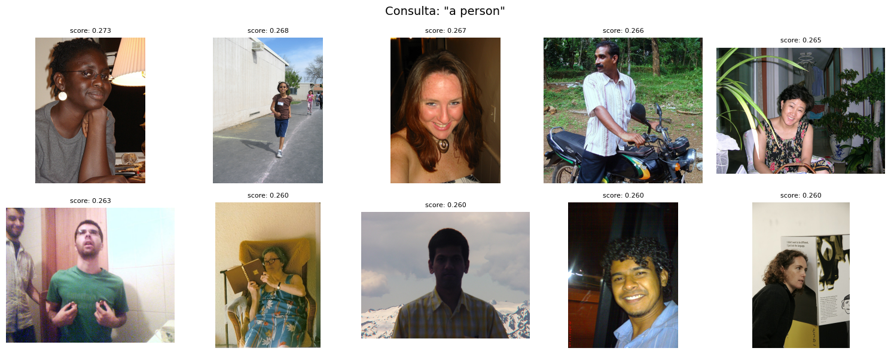
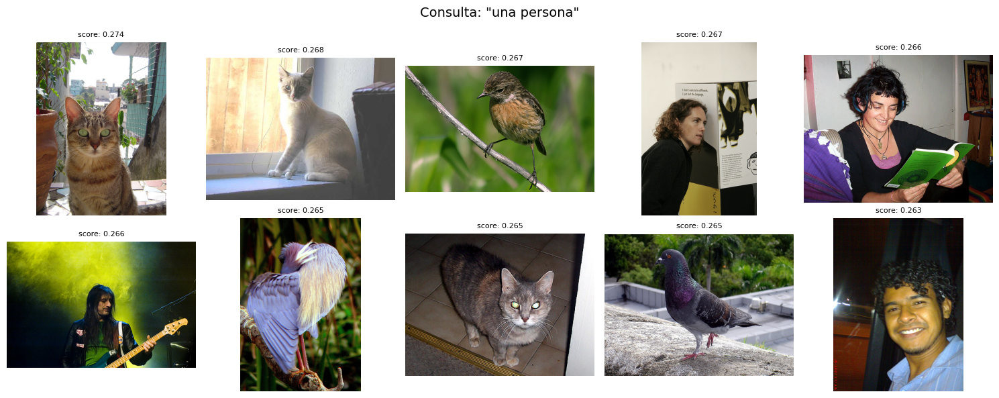
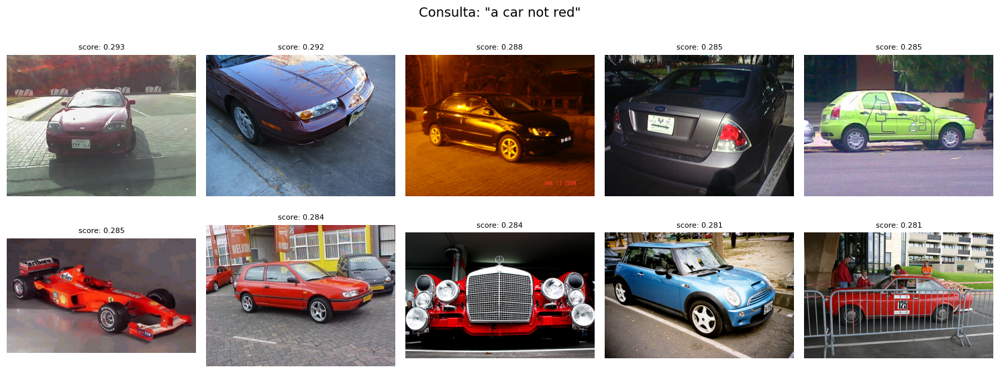
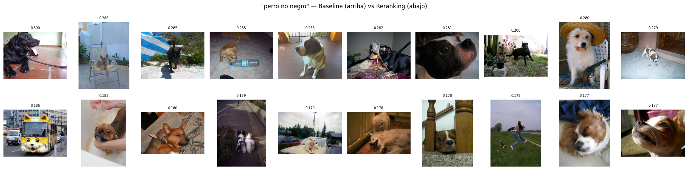
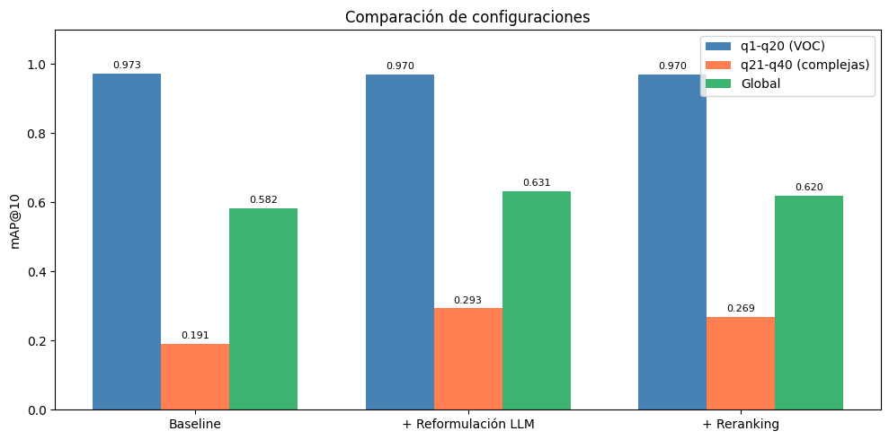
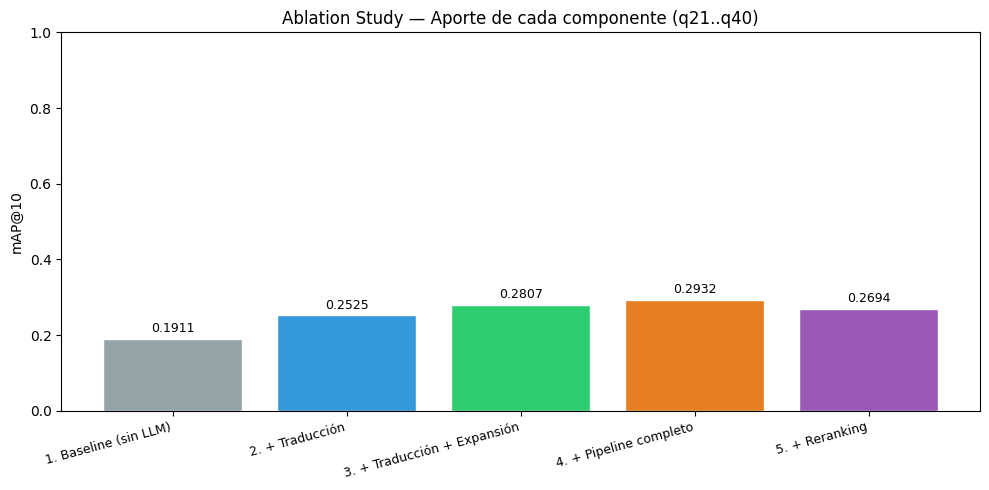

# Trabajo Práctico Integrador - Otoño 2026

**Materia:** Inteligencia Artificial - UTN FRC

**Cuatrimestre:** 1° Cuatrimestre

**Año:** 2026

**Grupo:** 8

## Integrantes

Figueroa Prada, Juan Uriel – 407213

Gomez Alameda, Romina Abigail – 85296

Saggiorato, Gina – 95794

Storello Chiofalo, Juan Ignacio – 85408

</br>

# Exploración del Dataset (EDA)

## Estadísticas básicas

El dataset utilizado corresponde a Pascal VOC 2012 y contiene un total de **17.125 imágenes**. Para realizar el análisis exploratorio se tomó una muestra aleatoria de 500 imágenes, con el objetivo de reducir los tiempos de procesamiento manteniendo una representación adecuada del conjunto.
Soobre la muestra se calcularon estadísticas descriptivas relacionadas con dimensiones y tamaño de archivo.

Las imágenes presentan un ancho promedio de **464,3 píxeles** y una altura promedio de **391,2 píxeles**. El tamaño promedio de los archivos es de **109,1 KB**, con dimensiones mínimas de **200 × 111 píxeles** y máximas de **500 × 500 píxeles**.
Además, todas las imágenes analizadas presentan **3 canales de color (RGB)**, por lo que el dataset está compuesto íntegramente por imágenes en color.


| Métrica           | Ancho (px) | Alto (px) | Tamaño (KB) |
|------------------:|----------: |----------:|-----------: |
| Promedio          | 464.3      | 391.2     | 109.1       |
| Desvío estándar   | 63.2       | 66.0      | 42.5        |
| Mínimo            | 200        | 111       | 16.0        |
| Mediana           | 500        | 375       | 112.2       |
| Máximo            | 500        | 500       | 242.7       |
</br>

## Distribución por clases

Las anotaciones del dataset fueron utilizadas únicamente con fines estadísticos. Para optimizar el procesamiento, cada clase fue contabilizada una sola vez por imagen, independientemente de la cantidad de objetos presentes. De esta forma, si una imagen contiene múltiples instancias de una misma clase (por ejemplo, tres personas), la clase se contabiliza una sola vez para esa imagen.

La clase más frecuente es **person**, presente en 9.583 imágenes. Le siguen **chair** (1.366), **dog** (1.341), **car** (1.284) y **cat** (1.128). Las clases menos representadas son **cow** (340), **sheep** (357) y **bus** (467).

Estos resultados evidencian un desbalance importante entre las distintas categorías del conjunto de datos.

## Visualizaciones

Se generaron distintas visualizaciones para analizar las características del dataset, incluyendo un gráfico de dispersión de dimensiones, histogramas de tamaño de archivo y gráficos de barras para la distribución por clases.



Con estas imágenes podemos observar mejor el desbalance entre las clases, siendo *person* la categoría dominante en el datset, ocupando más de la mitad de este.

Además, se seleccionó una muestra aleatoria de imágenes con el objetivo de inspeccionar visualmente la variedad de escenas y objetos presentes en el conjunto de datos.



</br>

# Metodología

## Pipeline general

El sistema se estructura en cuatro etapas encadenadas:

**1° Baseline CLIP + FAISS:** Aquí se realiza la búsqueda directa sin procesamiento de la consulta.

**2° Capa agéntica:** Se reformula la consulta y se válida antes de buscar las imágenes coincidentes.

**3° Reranking:** En el caso de consultas con negaciones se penalizan aquellos resultados que coincidan con los términos negativos.

**4° Generación de submission:** Realizamos la búsqueda completa para las 40 consultas oficiales.

# Embeddings con CLIP + Índice FAISS

## Carga del modelo CLIP

Se utilizó CLIP (ViT-B/32), un modelo capaz de representar imágenes y texto dentro de un mismo espacio semántico de 512 dimensiones.

El modelo fue cargado junto con las transformaciones necesarias para el preprocesamiento de imágenes y la tokenización de consultas textuales.

## Generación de embeddings

Todas las imágenes del dataset fueron procesadas mediante el encoder visual de CLIP para obtener una representación vectorial de 512 dimensiones. Los embeddings resultantes fueron normalizados utilizando norma L2 con el objetivo de trabajar posteriormente con similitud coseno.

Como resultado se obtuvo una matriz de embeddings de dimensión **(17125, 512)** donde cada fila representa una imagen y cada columna una característica del espacio semántico aprendido por CLIP.

Los embeddings fueron almacenados en disco para evitar recalcularlos en ejecuciones posteriores.

## Clustering exploratorio

En esta sección se realizó un análisis exploratorio sobre los embeddings globales de 512 dimensiones generados por CLIP. Seleccionamos una muestra aleatoria de 2000 imágenes y las agrupamos aplicando K-Means, en 20 clusters según su similitud semántica. 

Posteriormente, se aplicó t-SNE para proyectar los embeddings a dos dimensiones y facilitar así su visualización.



El gráfico demuestra que los embeddings generados por el modelo CLIP son altamente efectivos para capturar las características semánticas y visuales de las imágenes. La existencia de múltiples grupos (clusters) claramente separados indica que el modelo logra diferenciar y clasificar el conjunto de 2000 imágenes en categorías conceptuales distintas. 

También se puede notar la existencia de clusters (0, 2, 5, 9 y 10) que están densamente empaquetados pero que a la vez se encuentran separados del resto; y por el contrario, tenemos clusters superpuestos en la región central con una mayor dispersión, lo que sugiere conceptos visuales más amplios o ambiguos que dificultan una separación estricta de las imágenes.

Para interpretar el contenido de cada cluster, se visualizaron ejemplos cercanos al centroide (representativos) y ejemplos ubicados en los bordes del cluster (casos límite).



Con esta imágen podemos notar que el modelo logra agrupar las imágenes basándose en conceptos semánticos muy claros, más allá de simples similitudes de color o forma. Por ejemplo, para el cluster 0 la temática es caballos y equitación, mientras que para el cluster 2 la temática son gatos. Pero también debemos destacar que mientras en el centro del cluster el objeto principal está bien encuadrado y representa la idea central del grupo, al acercarnos a los límites o bordes del cluster podemos notar el impacto del fondo y contexto, por ejemplo, en el cluster 1 la temática principal son las motos, pero en las imágenes menos representativas encontramos una botella de aceite de motor y una camioneta.

## Construcción del índice FAISS

Para realizar búsquedas eficientes se utilizó FAISS (Facebook AI Similarity Search).

Se implementó un índice de tipo **IndexFlatIP**, que utiliza producto interno como métrica de similitud. Dado que los embeddings se encuentran normalizados, esta métrica equivale a la similitud coseno entre vectores.

El índice construido contiene 17.125 vectores indexados de 512 dimensiones cada uno.

## Búsqueda texto → imagen (baseline)

La estrategia baseline consiste en transformar una consulta textual en un embedding utilizando CLIP y posteriormente recuperar las imágenes más similares mediante FAISS.

El procedimiento implementado comprende la generación del embedding textual, su normalización y la búsqueda de los vecinos más cercanos dentro del índice. Como resultado, el sistema devuelve un ranking de imágenes ordenadas según su similitud con la consulta realizada.

Realizamos una búsqueda de imágenes para consultas simples en inglés (dog, car, person) y en español, y consultas con negaciones para identificar las limitaciones del baseline. Los resultados muestran que CLIP recupera adecuadamente conceptos positivos, pero presenta dificultades para interpretar restricciones negativas de forma directa.





# Capa agéntica: reformulación y validación de consultas

## Procesamiento de consultas mediante LLM

Se diseñó un pipeline de cuatro agentes independientes, cada uno con una responsabilidad acotada. El modelo utilizado es llama3.1:8b corriendo localmente vía Ollama, con temperatura 0.0 y semilla fija para garantizar reproducibilidad.

Inicialmente se incorporó una capa agéntica basada en un modelo de lenguaje ejecutado mediante OpenRouter, empleando el modelo Gemma 4 31B Instruct, pero lo descartamos por la inestabilidad que generaba para la reproducción del notebook en Kaggle. 

## Detección de idioma y traducción

Dado que CLIP fue entrenado principalmente en inglés, se implementó un agente encargado de detectar automáticamente el idioma de la consulta y traducirla cuando fuera necesario.

El agente devuelve el idioma detectado, la traducción al inglés y una indicación de si la consulta fue modificada. Esta etapa permite realizar búsquedas consistentes independientemente del idioma utilizado por el usuario.

Decisión de diseño del promt: se instruyó al LLM explícitamente para que no elimine negaciones durante la traducción, ya que era un error común en pruebas iniciales.

Un ejemplo de la respuesta brindada por el agente de traducción es:

`Consulta: 'perro corriendo en un parque'`

`Idioma: es/en`

`Traducción: dog running in a park`

`Traducido:  False'`

## Detección de negaciones

Se implementó un segundo agente encargado de identificar términos excluyentes dentro de la consulta.

El objetivo es separar la parte positiva de la búsqueda de los conceptos que deben excluirse. Por ejemplo, una consulta como "car not red" es transformada en una componente positiva ("car") y una lista de términos negativos ("red").

| Consulta                   | Positivo | Negativo    |
| -------------------------- | -------- | ----------- |
| car not red                | car      | red         |
| dog without collar         | dog      | collar      |
| bus not yellow and not old | bus      | yellow, old |

Este agente es muy importante para el modelo porque determina si se activa el reranking en etapas posteriores. Con la información obtenida se puede mejorar la recuperación y el ordenamiento de resultados.

## Expansión de sinónimos / normalización semántica

Le pedimos al agente por medio del promt que genere hasta 3 variantes semánticamente equivalentes de la parte positiva de la consulta. Estas variantes nos van ayudar a enriquecer la búsqueda, y sirven de apoyo cuando el término exacto de la consulta original tiene baja cobertura semántica en CLIP.

Ejemplo para `"dog":` `["dog", "Canine", "Furry friend", "Puppy portrait"]`

## Verificación de integridad

Este agente se encarga de verificar que la consulta reformulada sea coherente con la original, es decir, que no se pierda el concepto y el contexto central, que no seagreguen conceptos no relacionados, y que tenga sentido visual. Si detecta una inconsistencia, propone una corrección, y siempre devuelve el razonamiento detrás de su respuesta.

En los casos en que se detecta una negación en la consulta, decidimos omitir este paso, ya que el agente de negaciones ya maneja esos casos y pasar por verificación de integridad introducía errores adicionales.

## Orquestador

El orquestador encadena los cuatro agentes en orden y registra una traza de decisión por consulta, con el resultado de cada etapa. Esto permite mantener una trazabilidad sobre lo qué decidió el sistema y por qué.

De esta forma la decisión final puede ser una de tres:

| Decisión                  | Condición                                                                                  | 
| ------------------------- | ------------------------------------------------------------------------------------------ | 
| `consulta_valida`         | La integridad es correcta. Utilizamos la parte positiva de la consulta.                    | 
| `corregida_por_integridad`| El agente de integridad propuso corrección. La consulta utilizada es la sugerencia.        | 
| `fallback_a_traduccion`   | La integridad falló y no hay sugerencia, se utiliza la consulta original con la traducción | 


## Uso de prompts estructurados

Para garantizar respuestas consistentes por parte del modelo de lenguaje, se utilizaron prompts con formatos de salida estrictamente definidos. Esto permitió simplificar el procesamiento posterior y reducir errores de interpretación durante la extracción de resultados.

# Reranking para negaciones y atributos excluyentes

Para mejorar los resultados en consultas que contienen negaciones, se implementó un esquema de reranking basado en penalización de similitud.
 
El procedimiento consiste en recuperar 150 candidatos usando únicamente la componente positiva de la consulta. Posteriormente, para cada candidato se calcula su similitud con los términos negativos detectados. El score final se obtiene como:
 
```
score_final = score_positivo − α · max(0, score_negativo − 0.1)
```

Donde:

**α = 0.6** es el peso de penalización, elegimos este valor para que la penalización sea significativa sin anular completamente el score positivo. Un valor mayor produce penalizaciones más agresivas que pueden degradar la recuperación del objeto principal.

**0.1** es un umbral base para ignorar similitudes residuales de baja magnitud, este permite evitar penalizar imágenes que tienen similitud trivial con el término negativo.

<!-- IMAGEN COMPARATIVA BASELINE VS REFORMULACION VS RERANKING -->



# Evaluación de resultados

## Métrica AP@10 / mAP@10

La métrica utilizada es **Average Precision @10 (AP@10)**, que considera tanto la relevancia como el orden de los resultados. Se implementó localmente para evaluar cada configuración antes de subir a Kaggle. El **mAP@10** promedia el AP@10 sobre todas las consultas del conjunto.

## Consultas simples q1–q20 (clases VOC)

Para las 20 clases de Pascal VOC, el ground truth corresponde al conjunto de imágenes que contienen esa clase según las anotaciones oficiales. Los resultados del baseline son:
 
| Clase       | AP@10 Baseline | AP@10 +LLM | AP@10 +Reranking |
| ----------- | -------------: | ---------: | ---------------: |
| aeroplane   |         1.0000 |     1.0000 |           1.0000 |
| bicycle     |         1.0000 |     1.0000 |           1.0000 |
| bird        |         1.0000 |     1.0000 |           1.0000 |
| boat        |         1.0000 |     1.0000 |           1.0000 |
| bottle      |         1.0000 |     1.0000 |           1.0000 |
| bus         |         1.0000 |     1.0000 |           1.0000 |
| car         |         1.0000 |     1.0000 |           1.0000 |
| cat         |         1.0000 |     1.0000 |           1.0000 |
| chair       |         1.0000 |     1.0000 |           1.0000 |
| cow         |         1.0000 |     1.0000 |           1.0000 |
| diningtable |         0.8521 |     0.8789 |           0.8789 |
| dog         |         1.0000 |     1.0000 |           1.0000 |
| horse       |         0.8354 |     0.8354 |           0.8354 |
| motorbike   |         0.7800 |     0.7800 |           0.7800 |
| person      |         1.0000 |     1.0000 |           1.0000 |
| pottedplant |         1.0000 |     0.9000 |           0.9000 |
| sheep       |         1.0000 |     1.0000 |           1.0000 |
| sofa        |         1.0000 |     1.0000 |           1.0000 |
| train       |         1.0000 |     1.0000 |           1.0000 |
| tvmonitor   |         1.0000 |     1.0000 |           1.0000 |
| **mAP@10**  |     **0.9734** | **0.9697** |       **0.9697** |

Luego de un análisis pudimos notar que baseline ya obtiene resultados muy altos en consultas simples en inglés, y consideramos que es debido a que CLIP es más preciso cuando la consulta coincide con las categorías sobre las que fue entrenado. La reformulación no mejora en este caso porque las consultas ya están en inglés y son términos directos, entonces la generación de variantes puede generar más ruido o no mejoría.

Por ejemplo:

En el caso de `pottedplant` se redujo luego de realizar la reformulación; pero al contrario, para la consulta de `diningtable` la reformulación representa una mejora.

## Consultas complejas q21–q40

Se diseñó un esquema de evaluación basado en intersección de resultados parciales. Cada consulta compleja se descompone en componentes simples en inglés, y el ground truth aproximado se construye como la intersección de los top-200 resultados de cada componente.
 
Ejemplo: `"bicicleta junto a un árbol sin autos ni personas alrededor"` → componentes `['bicycle', 'tree']` → 4 imágenes relevantes.
 
Notamos una alta dispersión en la cantidad de imágenes relevantes encontradas por consulta, variando desde 0 imágenes para `q37: 'persona montando un caballo negro'` a 135 para `q40: 'autobús de dos pisos que no sea rojo'`.

## Comparación: baseline vs reformulación vs +reranking

| Configuración       | mAP@10 q1-q20 | mAP@10 q21-q40 | mAP@10 Global |
|---------------------|--------------:|---------------:|--------------:|
| Baseline            | 0.9734        | 0.1911         | 0.5822        |
| + Reformulación LLM | 0.9697        | 0.2932         | 0.6314        |
| + Reranking         | 0.9697        | 0.2694         | 0.6196        |

La reformulación muestra una mejora de +0.10 de mAP@10 sobre el baseline en consultas complejas en español. El reranking, en cambio, baja ligeramente respecto a la reformulación sola, lo que se analiza en la sección de discusión.

Realizamos un gráfico para observar con mayor claridad la variación de los resultados:



## Ablation study

En esta sección aislamos el aporte de cada componente (CLIP solo, +LLM, +reranking) para mostrar cuánto suma cada uno.

| Configuración               | mAP@10 q21-q40 | Δ vs anterior |
|-----------------------------|---------------:|--------------:|
| 1. Baseline (sin LLM)       | 0.1911         | -             |
| 2. + Traducción             | 0.2525         | +0.0614       |
| 3. + Traducción + Expansión | 0.2807         | +0.0282       |
| 4. + Pipeline completo      | 0.2932         | +0.0125       |
| 5. + Reranking              | 0.2694         | -0.0238       |

El mayor aporte individual es la traducción **(+0.06)**, seguido de la expansión de sinónimos **(+0.03)**. La verificación de integridad suma poco en términos de mAP pero aporta robustez ante casos de reformulación incorrecta. El reranking tiene efecto negativo global porque el ground truth propio (construido por intersección) no captura bien los casos de exclusión.



# Generación de submission.csv (Kaggle)

El archivo submission.csv contiene una fila por consulta (q1 a q40) con las columnas qid y preds. Cada fila incluye exactamente 10 image IDs sin extensión .jpg, separados por ;, ordenados de mayor a menor relevancia.

Las consultas q1-q20 corresponden a las 20 clases VOC buscadas en inglés con el baseline y las consultas q21-q40 corresponden a consultas complejas obtenidas desde solution.csv de la cátedra.

# Conclusiones

## Cosas que funcionaron correctamente

- La traducción es el componente que generó un mayor impacto positivo: pasar de consultas en español a inglés mostró una mejora el mAP en consultas complejas en más de 6 puntos porcentuales.

- La expansión de sinónimos y normalización semántica mejora la búsqueda ampliando el espectro especialmente en consultas con términos que son poco frecuentes en el vocabulario de CLIP.

- Mostrar las trazas de decisión nos permitió detectar errores en el pipeline (como negaciones que el LLM no preservaba durante la traducción) y logramos corregirlos con instrucciones más explícitas en el prompt.

## Cosas que no funcionaron como esperabamos y tuvimos que corregir

- Como ya mencionamos, al principio el agente de traducción eliminaba la negación, por lo que tuvimos que defniri instrucciones más explícitas en el prompt ("not red" must NOT become "is red").

- Al comienzo implementabamos reranking con solo el atributo que no debía estar presente en la imagen, y pudimos notar que aunque generaba cierta mejora, seguía mostrando imágenes incorrectas. Por ejemplo, para "persona no sentada" nos seguía mostrando personas sentadas. En esta sección fue donde pudimos notar una de las mayores limitaciones de CLIP y FAISS: No entiende las negaciones, por lo tanto al hacer la búsqueda de persona NO sentada, traía imágenes con personas sentadas.

Para solucionar esto decidimos unir la parte positiva de la oración con el atributo que se encontraba negado en la consulta original; así la penalización era mucho más efectiva, ya que se buscaba lo que NO queremos y lo penalizamos.

- Otra de las limitaciones encontradas fue que CLIP ViT-B/32 captura atributos pero no los asocia al objeto al cual le pertenece ese atributo. Por ejemplo, en el caso de `"una moto estacionada al lado de un auto no rojo"`, en una imagen que contiene una moto roja y un auto azul, CLIP solo procesa que hay algo `rojo` una `moto` y un `auto`, lo que genera que se puedan penalizar imágenes válidas debido a que contienen los 3 elementos que también buscamos penalizar. 

Esto también se puede notar cuando hay colores en la consulta que pueden ser confundidos con el entorno o el paisaje, por ejemplo los colores azul y verde, se pueden confundir con el cielo o el mar y el pasto respectivamente. 

Esta literalidad que maneja en ciertas ocasiones CLIP también genera falsos positivos. Por ejemplo,`"perro jugando en el agua"` hace que CLIP devuelva imágenes incorrectas por asociar una `botella de agua` con el término `agua`.
